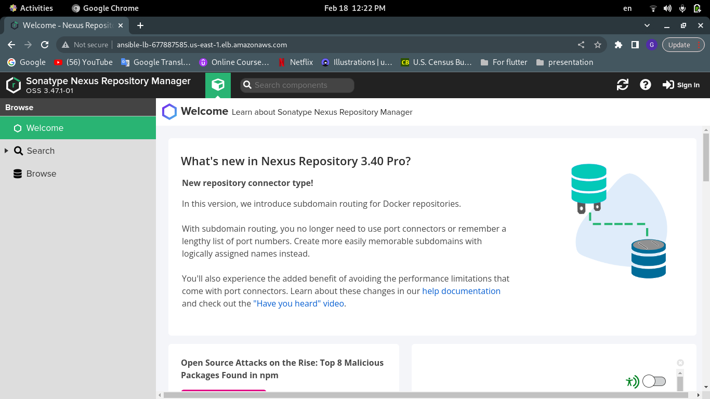
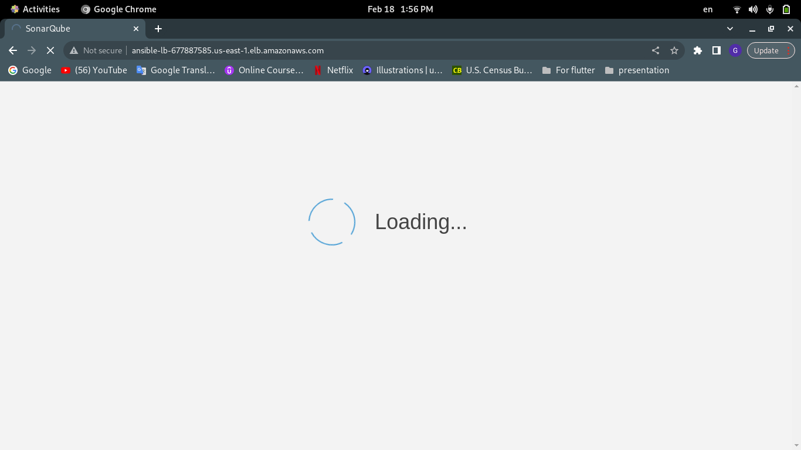

# Ansible Day2 
--- 

### Nexus-SonarQube Using Ansible & Terraform

A Task to install nexus and sonarQube using ansible on aws ec2 private instances

##### You need 
   1) Application loadbalancer to access private instances
   2) 4 subnets (2 Pubilic,2 Private)
   3) NAT gatway
   4) InternetGatway
   5) 2 private ec2
   6) 1 public ec2 (Jumb host)


#### To build the infrastructure
###### You got modules for every component you can edit what you want from the main.tf

---
Go to terrafrom directory and run

```bash 
terraform init
terrafrom apply 
```
> **_NOTE:_** You will have a file in terraform directory called all-ip.txt this file contains all instances ips 


#### Ansible Part

###### First you need to add config file in the ~/.ssh directory

```bash
Host bastion

        hostname # Bastion Ip
        user ubuntu
        port 22
        identityfile # Path To bastion key.pem
```

Go to Ansible directory and run 
```bash
ansible-playbook playbook.yml -i inventory.txt
```
###### Don't forget to put your instances ips in the inventory file

#### ScreenShots

Nexus Downloaded 




---

SonarQube Downloaded


